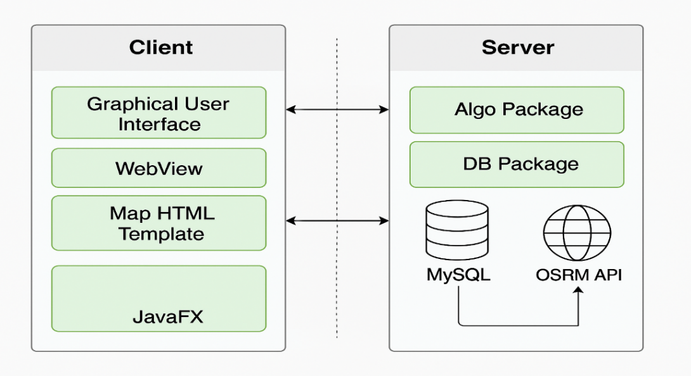
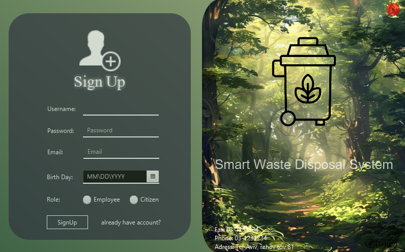
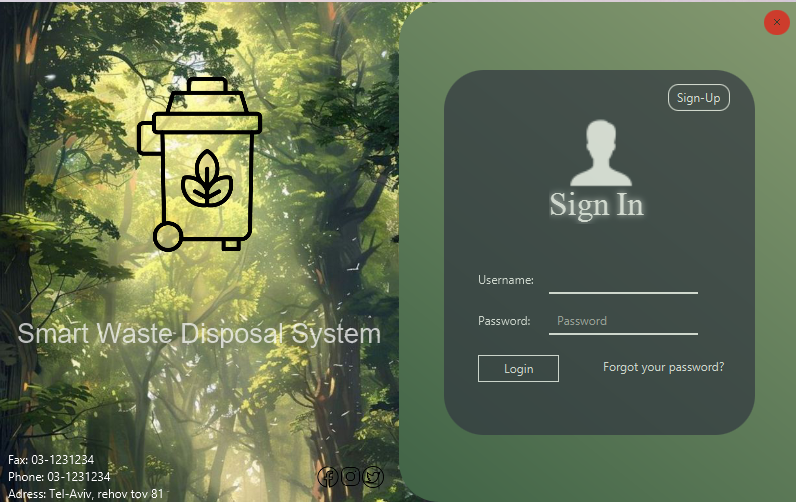
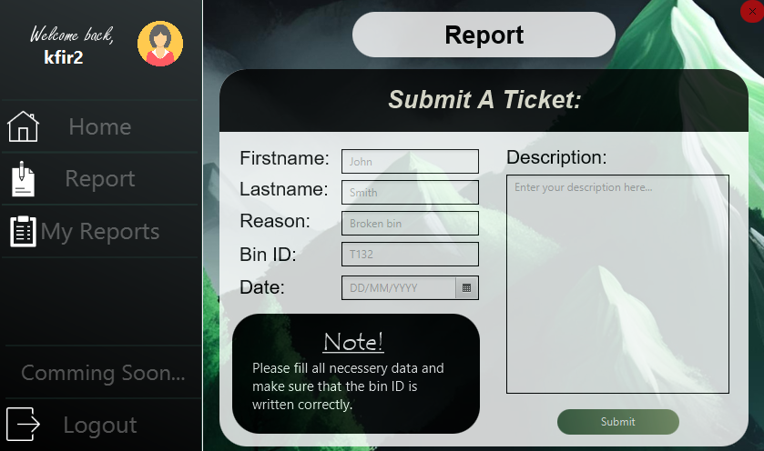
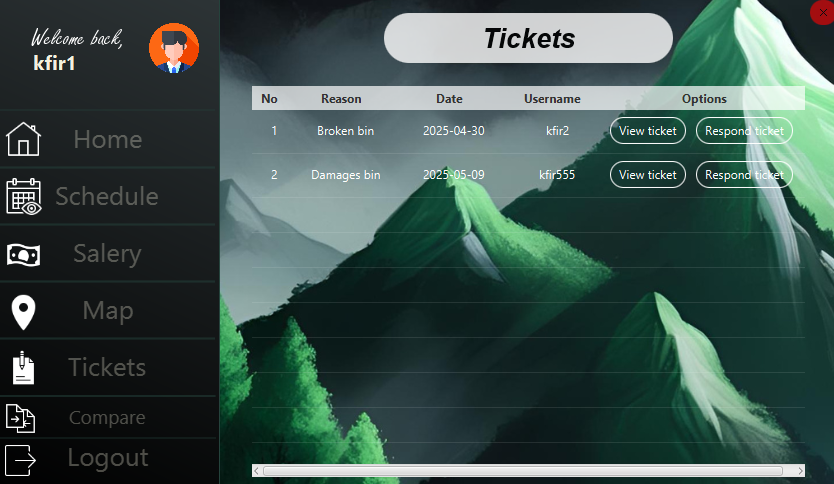
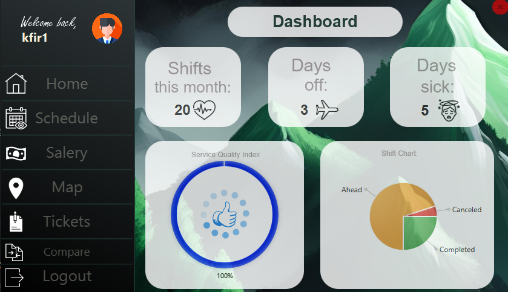
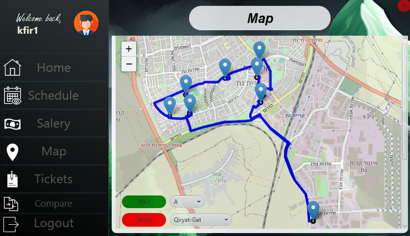
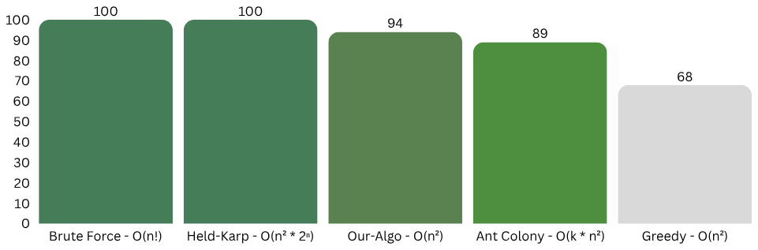

<p align="center">
  
</p>

## 


<p align="center">
  
  
  
  
  
  
  
  
  
  
  
  
  
  
  
</p>

## 📋 Overview
**Smart Waste Disposal & GPS System** is a **JavaFX-based smart waste management platform** designed to **optimize urban garbage collection** using **IoT ultrasonic sensors** and **real-time GPS routing**.  
It reduces operational costs, lowers carbon emissions and empowers **city managers, waste collection employees and citizens** to collaborate in keeping cities clean and efficient.

---

## 🚀 Motivation for Development

The idea for developing the system stemmed from the desire to tackle a real urban challenge—collecting waste in a smart and efficient way.

Our goal was to create a system that uses readily available technologies, such as smart sensors, and focuses on improving work processes without requiring complex infrastructure changes.

We aimed to build a solution that, through real-time data collection, could provide value to the municipality, field workers, and residents alike.

Throughout the development process, our guiding principle was to create a system that is accessible, effective, and positively impacts the environment.

---

## 🧩 System Architecture

<p align="center">
  
</p>

**General Structure:**

-Client:

* Intuitive graphical interface

* Display of interactive maps

* Presentation of reports and results

-Server:

* Retrieving and updating data from the MySQL database

* Calculating optimal routes according to the bins’ fill levels

* Sending requests to OSRM for realistic road-based route calculations

**Main System Components:**

**Controllers**: JavaFX controller classes responsible for receiving user input and displaying data.

**Algo Package**: Implements a **Traveling Salesman Problem (TSP)–inspired algorithm**, enhanced with:
  - Priority handling (full bins first).
  - Truck capacity constraints(in addition to distance).
  - 2-Opt optimization to shorten routes.

**DB Package**: Handles all communication with the MySQL database, including data retrieval and updates.

**WebView**: Used to display the interactive map with the route calculated by OSRM.

**Map HTML Template**: An HTML file loaded inside the WebView that dynamically renders the map and route.

---

##  🎯 Project Goal

The goal of the project is to develop an intelligent system for managing and collecting municipal waste, based on advanced technologies, in order to improve the operational efficiency of the city’s sanitation network.
The system aims to reduce the use of resources—such as ⛽ fuel, 👷 manpower, and ⏱️ time—by optimizing collection routes according to real-time data received from 🛰️ smart sensors installed in the bins.

In addition to its operational objectives, the system is designed to help reduce 🌱 greenhouse-gas emissions and the city’s carbon footprint ♻️ by cutting down on unnecessary trips of service vehicles.

From a service perspective, the system enables direct citizen involvement 🧑‍🤝‍🧑: city residents can report ⚠️ faults, 🗑️ full bins, or other operational problems through a dedicated interface, thereby improving service quality 💡, shortening response times ⏳, and strengthening the citizens’ sense of partnership 🤝 in maintaining the public space.

---

## ⚙️ Technology Stack
- **Java** – Core logic and backend processing.
- **JavaFX** – Rich graphical desktop interface.
- **MySQL** – Central database for bins, routes, users, and reports.
- **OSRM** – Realistic road-based routing.
- **OpenStreetMap** – Interactive map display.
- **Ultrasonic Sensors** – Real-time bin fill-level monitoring.

---

## ✨ Features
-  **Real-Time Bin Monitoring**: Ultrasonic sensors report fill levels.
-  **Optimal Route Generation**: OSRM calculates shortest practical routes considering capacity and priorities.
-  **Role-Based Access**:
  - **City Managers**: View fill levels, generate routes, monitor performance.
  - **Employees/Drivers**: Receive optimal routes and track progress.
  - **Citizens**: Report faults or full bins.
-  **Dynamic Prioritization**: Full bins collected first; adaptive to truck capacity.
-  **Comprehensive Reports**: Performance stats and historical data exportable to PDF.

---

## Screenshots

### User Authentication
<div style="display: flex; gap: 10px;">
  
  

</div>

### Citizen Report System
<div style="display: flex; gap: 10px;">
  
  

</div>

### Employee Dashbored & Scheduled Routes
<div style="display: flex; gap: 10px;">
  
  

</div>

---

## Performance

### <p>Our system demonstrates fast response times and efficient route calculations for waste collection, ensuring optimal performance.</p>


---

## 💡 Getting Started

### Prerequisites
- Java 17+
- MySQL 8.0+
- OSRM server (or access to OSRM API)

### Installation

#### 1. Clone the Repository
```bash
git clone https://github.com/Kfir989/SmartWasteDisposal_And_GPS_System.git
cd SmartWasteDisposal_And_GPS_System
````
#### 2️. Set Up the Database with XAMPP.

#### 3. Import the provided SQL schema.

#### 4. Run the OSRM Server
````
Make sure an OSRM backend is running and accessible:

Follow OSRM installation instructions.
Or use a hosted OSRM instance if available.
````
#### 5. Launch the Application(Landing page)

---
